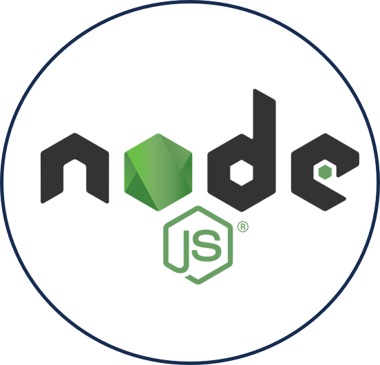
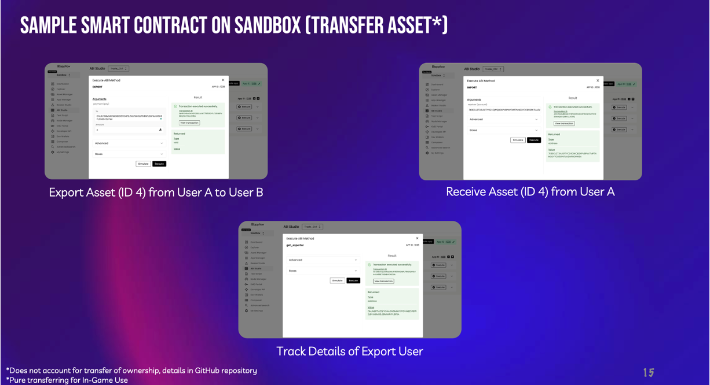

    

  <i>Your AI Companion for Breaking Imagination </i>

&nbsp;

<h1>📖 A Guide to Graphyti </h1>

 Introducing <b>Graphyti</b>, the first game in the world to allow the creation of personalised physics through generative AI and blockchain. 

 With generative AI currently focused on the rendering of visually striking images, our team proposes an idea that goes beyond the current concept of image generation to instead allow users to customise even the physics itself. In our product, we hope to allow users to personalise their own 3D world with its own unique physics from scratch, using a series of text and image prompts. 

&nbsp;

<h1>⚙️ Technology Stack </h1>

  <kbd>
      
  </kbd>
  <kbd>
      
  </kbd>
  <kbd>
      
  </kbd>
  <kbd>
      
  </kbd>
  <kbd>
      
  </kbd>
  <kbd>
      
  </kbd>
  <kbd>
      
  </kbd>
  <kbd>
      
  </kbd>
  <kbd>
      
  </kbd>
    
  <b> PyTeal | Unity | OpenAI | Infinigen | ReactJS | NodeJS | PyTorch | Docker | AWS </b>

&nbsp;

<h1>📽️ Demo Video </h1>

Youtube Video Link: Click <a href="https://youtu.be/QmGae7A_Sec">here</a> 

&nbsp;

<h1>🎮 Core Web3.0 Game Mechanisms Utilising the Algorand Blockchain </h1>
<h2>1. Physics NFTs</h2>

We first serialize the physics parameters into a JSON string, which is then recorded in an Algorand smart contract using PyTeal. The smart contract logic includes the creation of an NFT using the ASA specification when the physics parameters are recorded. The NFT creation is triggered by a transaction, and the metadata of the NFT includes the serialized JSON string. Additionally, the Algorand SDK in Python is utilized to mint the NFT by submitting a transaction to the Algorand blockchain, signing it with the sender's private key, and sending it to the network for processing.

<h2>2. Smart Contracts</h2>

Algorand smart contracts are employed for two key functionalities. Firstly, users can securely trade their customized physics settings through a smart contract that maintains state variables for user addresses and their settings. The contract includes a method enabling users to transfer ownership of their physics configurations to other users. Secondly, a reward mechanism is implemented based on a scoring algorithm. The algorithm combines community voting and physics settings' complexity with a 50-50 weightage, determining user scores. Higher scores yield increased AlgoToken rewards. Users can participate in community voting and have their physics configurations evaluated, fostering engagement and collaboration within the game. These decentralized smart contracts ensure transparent and fair execution of both trading and reward mechanisms.

<h2>3. Digital Passport</h2>

We propose the implementation of a decentralized digital passport system on the Algorand blockchain, where users can create and retrieve passport data. The stored information is intended to authenticate users when entering each other's worlds within the game. Upon creation, user data is securely stored. Subsequent calls fetch the passport information, facilitating user authentication for seamless entry into shared virtual environments.

<h2>4. Verifiable Random Function</h2>

VRF is adapted to work within the context of an AI-generated game where customizable physics can influence the game outcomes.

1. Generating Seed, Salt, and Hash:
generate_seed_salt_hash: This function creates a random seed and salt using cryptographic methods and derives their hashes. It's a critical step in establishing unique and unpredictable values for further calculations.

2. Generating an Outcome:
generate_outcome: Given a private key, a game-specific parameter (alpha), and customizable physics parameters, this function creates a verifiable game outcome.
It utilizes the seed, salt, and other parameters to generate a unique and deterministic outcome that's influenced by the provided physics parameters.

3. Generating Beta and Proof:
generate_beta_and_proof: This function is responsible for creating a random value (beta), its corresponding proof, and the game outcome based on the provided parameters.
It incorporates the seed, salt, alpha, and the customizable physics parameters to create a unique deterministic value (beta) and a digital signature (proof) using the private key.
The outcome is calculated based on beta, influenced by the physics parameters, ensuring that game results are influenced by these customizable aspects.

 4. Verifying the Outcome:
verify: This function ensures the integrity and authenticity of the generated outcome.
It verifies the proof with the public key to ensure its validity and checks if the derived hash matches the provided hash, guaranteeing that the game's outcome hasn't been tampered with and is indeed verifiable.

<h1>🤖 Multi-Agent Pipeline Utilising Generative AI and Unity </h1>
This pipeline focuses on how we handled the full environment development process on Unity, starting from the rendering all the way to the dynamic adjustment of physics based on text prompts.
<h2>1. Rendering Agent: Generating 3D Worlds with Infinigen & Wave Function Collapse Algorithm</h2>

Initially, the Infinigen framework can be used to generate the base terrain and larger environmental structures. This includes creating landscapes like mountains, valleys, rivers, and plains. Infinigen's procedural generation algorithms ensure that these terrains are vast, diverse, and infinite, providing a broad canvas for further detailing.

Once the base terrain is generated, the WFC algorithm can be applied to populate these terrains with smaller-scale details. WFC is particularly effective in creating complex, local patterns that obey specific rules, like tiling patterns for city streets, arrangement of trees in a forest, or the layout of rocks and vegetation. It ensures that these details are coherent and follow the logical structure of the environment.

<h2>2. Language Agent: Finetuning Text Prompts & Physics Parameters with Custom Text-Based Physics Engine</h2>

We developed a natural language processing (NLP) module that analyses user's inputs and transforms it into a more technically accurate and detailed prompt. We integrated the prompts into a mapping system that translates such refined prompts into specific physics parameters. For example, "reverse gravity" could be mapped to negative values for gravitational force in the engine's physics calculations. 

<h2>3. Construct Agent: OpenAI LLM Code Generation on Unity</h2>

We integrated OpenAI's API into the Unity engine, such that the system takes the refined text input from the previous step to adjust the required physics parameters. The LLM dynamically compiles the code such that a new game environment is built on the Unity engine.

<h1>📱 Our 3-Step User Journey</h1>
<h2> Step 1 : Set up your digital passport and Algorand wallet </h2>
<th style="align-items: center;"></th>
<th style="text-align: center;"></th>
<th style="text-align: center;"></th>
<h2> Step 2 : Set up your world with Graphyti </h2>
<th style="text-align: center;"></th>
<th style="text-align: center;"></th>
<th style="text-align: center;"></th>
<th style="text-align: center;"></th>
<h2> Step 3 : See whats buzzing in the decentralised NFT marketplace </h2>
<th style="text-align: center;"></th>
<th style="text-align: center;"></th>

<h1> Our Enterprise Architecture </h1>

<h1> The Team </h1>
<table>
  <tr>
    <th></th>
    <th></th>
    <th></th>
    <th></th>
  </tr>
  <tr>
    <td align="center"><h3><b><a href="https://github.com/howllian27">Howell Chan</a></b></h3>
<i>Nanyang Technological University</i>
</td>
    <td align="center"><h3><b><a href="https://github.com/XeuniceX">Eunice Lee</a></b></h3>
<i>Nanyang Technological University</i>
</td>
    <td align="center"><h3><b><a href="https://github.com/chenglin2003">Cheng Lin</a></b></h3>
<i>Nanyang Technological University</i>
</td>
    <td align="center"><h3><b><a href="https://github.com/JF-Lim">Lim Jin Feng</a></b></h3>
<i>Nanyang Technological University</i>
</td>
  </tr>
  <tr>
    <td align="center"><h3><b>
AI/Unity Developer
</b></h3></td>
    <td align="center"><h3><b>
Blockchain Developer
</b></h3></td>
    <td align="center"><h3><b>
Frontend Developer
</b></h3></td>
    <td align="center"><h3><b>
UI/UX Designer
</b></h3></td>
  </tr>
</table>
