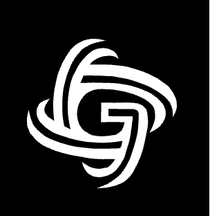
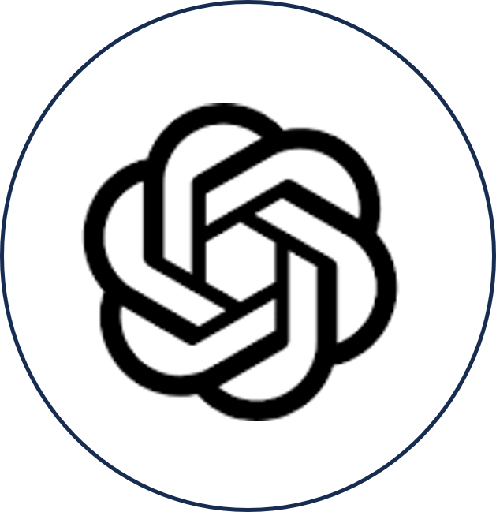

    

  <i>Your AI Companion for Breaking Imagination </i>

&nbsp;

<h1 align="center">📖 A Guide to Graphyti </h1>

 Introducing <b>Graphyti</b>, the first game in the world to allow the creation of personalised physics through generative AI and blockchain. 

 With generative AI currently focused on the rendering of visually striking images, our team proposes an idea that goes beyond the current concept of image generation to instead allow users to customise even the physics itself. In our product, we hope to allow users to personalise their own 3D world with its own unique physics from scratch, using a series of text and image prompts. 

&nbsp;

<h1>⚙️ Technology Stack </h1>

  <kbd>
      
  </kbd>
  <kbd>
      
  </kbd>
  <kbd>
      
  </kbd>
  <kbd>
      
  </kbd>
  <kbd>
      
  </kbd>
  <kbd>
      
  </kbd>
  <kbd>
      
  </kbd>
  <kbd>
      
  </kbd>
  <kbd>
      
  </kbd>
    
  <b> PyTeal | Unity | OpenAI | Infinigen | ReactJS | NodeJS | PyTorch | Docker | AWS </b>

&nbsp;

<h1>📽️ Demo Video </h1>

Youtube Video Link: Click <a href="https://www.youtube.com/watch?v=HC3zb6tuXyQ">here</a> 

&nbsp;

<h1>🔨 Core Functionalities </h1>
<h2>Verifiable Random Function</h2>

It's adapted to work within the context of an AI-generated game where customizable physics can influence the game outcomes.

1. Generating Seed, Salt, and Hash:
generate_seed_salt_hash: This function creates a random seed and salt using cryptographic methods and derives their hashes. It's a critical step in establishing unique and unpredictable values for further calculations.

2. Generating an Outcome:
generate_outcome: Given a private key, a game-specific parameter (alpha), and customizable physics parameters, this function creates a verifiable game outcome.
It utilizes the seed, salt, and other parameters to generate a unique and deterministic outcome that's influenced by the provided physics parameters.

3. Generating Beta and Proof:
generate_beta_and_proof: This function is responsible for creating a random value (beta), its corresponding proof, and the game outcome based on the provided parameters.
It incorporates the seed, salt, alpha, and the customizable physics parameters to create a unique deterministic value (beta) and a digital signature (proof) using the private key.
The outcome is calculated based on beta, influenced by the physics parameters, ensuring that game results are influenced by these customizable aspects.

 4. Verifying the Outcome:
verify: This function ensures the integrity and authenticity of the generated outcome.
It verifies the proof with the public key to ensure its validity and checks if the derived hash matches the provided hash, guaranteeing that the game's outcome hasn't been tampered with and is indeed verifiable.

<h2> Step 1 : Set up your digital passport and Algorand wallet </h2>
<th></th>
<h2> Step 2 : Set up your world with Graphyti </h2>
<th></th>
<th></th>
<th></th>
<th></th>
<h2> Step 3 : See whats buzzing in the decentralised NFT marketplace </h2>
<th></th>

<h1> Our Enterprise Architecture </h1>
<h1> The Team </h1>
<table>
  <tr>
    <th></th>
    <th></th>
    <th></th>
    <th></th>
  </tr>
  <tr>
    <td align="center"><h3><b><a href="https://github.com/howllian27">Howell Chan</a></b></h3>
<i>Nanyang Technological University</i>
</td>
    <td align="center"><h3><b><a href="https://github.com/XeuniceX">Eunice Lee</a></b></h3>
<i>Nanyang Technological University</i>
</td>
    <td align="center"><h3><b><a href="https://github.com/chenglin2003">Cheng Lin</a></b></h3>
<i>Nanyang Technological University</i>
</td>
    <td align="center"><h3><b><a href="https://github.com/JF-Lim">Lim Jin Feng</a></b></h3>
<i>Nanyang Technological University</i>
</td>
  </tr>
  <tr>
    <td align="center"><h3><b>
AI/Unity Developer
</b></h3></td>
    <td align="center"><h3><b>
Blockchain Developer
</b></h3></td>
    <td align="center"><h3><b>
Frontend Developer
</b></h3></td>
    <td align="center"><h3><b>
UI/UX Designer
</b></h3></td>
  </tr>
</table>
